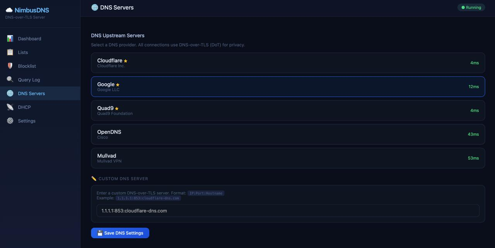
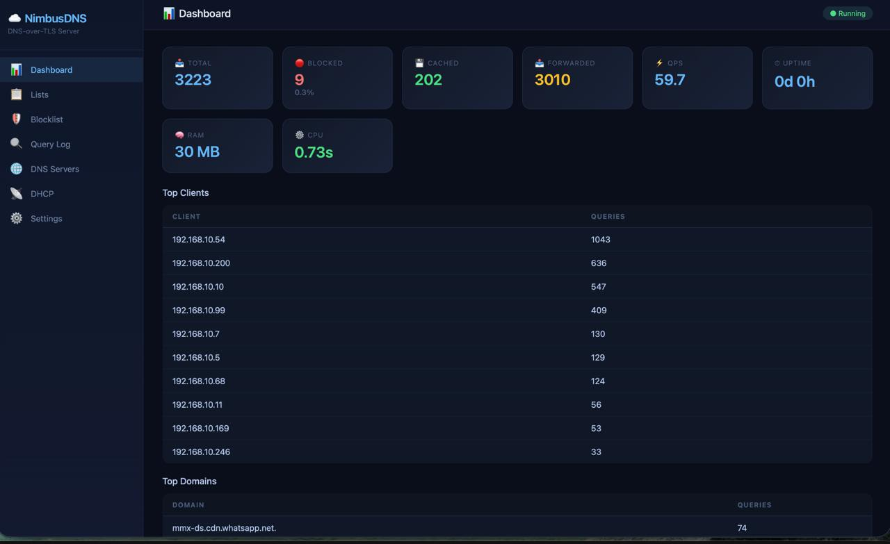

# NimbusDNS

DNS-over-TLS server with web panel, DHCP, ad blocking, and admin auth.

## Features

- **DNS-over-TLS (DoT)** - Encrypted upstream DNS to Google, Cloudflare, Quad9, OpenDNS, Mullvad
- **Ad Blocking** - StevenBlack hosts blocklist with auto-refresh
- **Web Panel** - Dark theme, responsive, setup wizard, session auth + optional TOTP
- **DHCP Server** - Built-in DHCP with IP pool management
- **Query Log** - Searchable query history with overTime stats
- **Performance** - Rust, LRU cache, batch DB writes, EDNS0, graceful shutdown

## Screenshots

  

## Quick Start

### Docker

```bash
docker pull ismkdc/nimbusdns:latest

docker run -d --name nimbusdns --restart unless-stopped --network host \
  -v /etc/nimbusdns/nimbus.toml:/etc/nimbusdns/nimbus.toml \
  -v nimbusdns-data:/var/lib/nimbusdns \
  --cap-add NET_ADMIN --cap-add NET_BIND_SERVICE \
  ismkdc/nimbusdns:latest
```

### Docker Compose

```yaml
services:
  nimbusdns:
    image: ismkdc/nimbusdns:latest
    container_name: nimbusdns
    restart: unless-stopped
    network_mode: "host"
    cap_add:
      - NET_ADMIN
      - NET_BIND_SERVICE
    volumes:
      - /etc/nimbusdns/nimbus.toml:/etc/nimbusdns/nimbus.toml
      - nimbusdns-data:/var/lib/nimbusdns

volumes:
  nimbusdns-data:
```

Save as `docker-compose.yml` and run:

```bash
docker compose up -d
```

Open http://localhost:8181 to access the web panel.

## Configuration

Place `nimbus.toml` at `/etc/nimbusdns/nimbus.toml`:

```toml
[dns]
upstreams = [
  {Tls = {address = "8.8.8.8", port = 853, hostname = "dns.google"}},
  {Tls = {address = "8.8.4.4", port = 853, hostname = "dns.google"}},
]
bind = "0.0.0.0:53"
blocking-mode = "NULL"
query-log = true

[webserver]
ports = ["8181o"]

[dhcp]
enabled = true
pool-start = "192.168.1.100"
pool-end = "192.168.1.200"
router = "192.168.1.1"
lease-time = 86400

[blocking]
source-url = "https://raw.githubusercontent.com/StevenBlack/hosts/master/hosts"
refresh-interval = 86400

[misc]
enable-ipv6 = false
```

## Build from Source

```bash
cargo build --release --bin nimbusdns
```

## Docker Build

```bash
docker build -t nimbusdns .
```

## License

[MIT](LICENSE)
